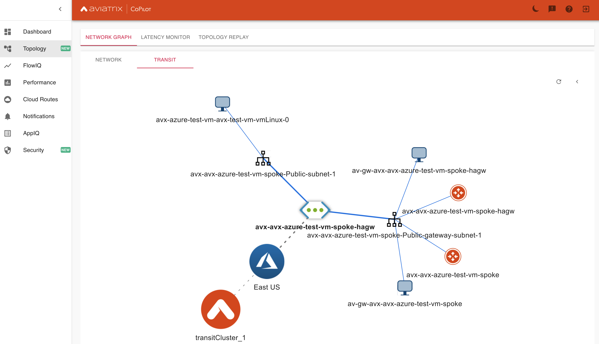

# Aviatrix Transit Azure OCI Simple

### Summary

This repo builds Aviatrix Transit in Azure with spokes attached in Azure and OCI, each with test vm. 
The Azure test VM will use password authentication (randomly generated), have port 22 open and have a public IP. The OCI test VM will be authenticated by an ```ssh_key``` defined in ```terraform.tfvars```.
Each test VM will have [Oracle Instant Client 21c](https://www.oracle.com/database/technologies/instant-client/linux-x86-64-downloads.html) basic client installed, iperf3, and sqlplus with ```$TNS_ADMIN``` set for the default user ```azureuser``` and ```opc```.

[Oracle Autonomous Database](https://docs.oracle.com/en/cloud/paas/autonomous-database/index.html) created in OCI spoke with a [private endpoint](https://docs.oracle.com/en-us/iaas/Content/Database/Concepts/adbsprivateaccess.htm) and IP; the database wallet will be generated where you run this as a zip file in ```./modules/adb```. Copy it where you need it
and unzip into ```$TNS_ADMIN```. 

Additionally an [AKS](https://azure.microsoft.com/en-us/services/kubernetes-service/) cluster is created if that's your thing; check ```./kube_config``` directory for the config file.

This example is simple, Aviatrix Transit gateways and spokes could be placed in OCI, AWS, or GCP wherever needed. After you have [Aviatrix Controller and Access Accounts](https://docs.aviatrix.com/) in OCI and Azure onboarded, the provisioning process takes about an hour.

### BOM

- 1 Aviatrix Transit in Azure 
- 4 Aviatrix spokes defined in ```terrraform.tfvars``` attached to Aviatrix Transit Gateway.
- 1 Azure Resource Group with Ubuntu 18.04 VM per spoke (iperf3 installed)
- 1 Oracle Autonomous DB
- 1 OCI OEL test vm using a 1:1 [Flexible shape](https://docs.oracle.com/en-us/iaas/Content/Compute/References/computeshapes.htm)
- 1 AKS Spoke
- 1 nginx helm chart deployed to Azure Kubernetes Service

**_Note_** setting the ```ha_enabled``` flag in ```terraform.tfvars``` will build all Aviatrix Gateways in High Availability mode.

### Infrastructure diagram


### Aviatrix Controller


### Aviatrix CoPilot




### Azure Kubernetes 

Note the Cluster IP and External IPs for the nginx service.


### Azure Resource Group


### Compatibility
Terraform version | Controller version | Terraform provider version
:--- | :--- | :---
0.13 | 6.3 | 2.18.1

### Modules

Module Name | Version | Description
:--- | :--- | :---
[terraform-aviatrix-modules/azure-transit/aviatrix](https://registry.terraform.io/modules/terraform-aviatrix-modules/azure-transit/aviatrix/latest) | 3.0.0 | This module deploys a VNET, Aviatrix transit gateways.
[terraform-aviatrix-modules/azure-spoke/aviatrix](https://registry.terraform.io/modules/terraform-aviatrix-modules/azure-spoke/aviatrix/latest) | 3.0.0 | This module deploys a VNET and an Aviatrix spoke gateway in Azure and attaches it to an Aviatrix Transit Gateway
[terraform-aviatrix-modules/oci-spoke/aviatrix](https://registry.terraform.io/modules/terraform-aviatrix-modules/oci-spoke/aviatrix/latest) | 3.0.0 | This module deploys a VCN and an Aviatrix spoke gateway in OCI and attaches it to an Aviatrix Transit Gateway
[Azure/compute/azurerm](https://registry.terraform.io/modules/Azure/compute/azurerm/0.9.0) | 0.9.0 | Azure Terraform module to deploy virtual machines

### Helm Charts
Chart | Version | Description
:--- | :--- | :---
[bitnami/nginx](https://artifacthub.io/packages/helm/bitnami/nginx) | 8.7.1 |  NGINX (pronounced "engine-x") is an open source reverse proxy server for HTTP, HTTPS, SMTP, POP3, and IMAP protocols, as well as a load balancer, HTTP cache, and a web server (origin server).

### Variables

The variables are defined in ```terraform.tfvars```.

**Note:** ```ha_enabled = false``` controls whether ha is built for spokes. 

```instance_size``` controls the size of all the transit spokes and gateways. 

```test_instance_size``` controls the size of the test vms.

OCI gateways are ```VMStandard2.2```, Flex VM is 1 OCPU/ 1gb memory

### Prerequisites

- Software version requirements met
- Aviatrix Controller with Access Account in Azure and OCI
- Sufficient limits in place for regions in scope **_(Compute quotas, etc.)_**
- terraform .13 in the user environment ```terraform -v``` **_or use hashicorp/terraform docker image_** Instructions below.
- [Install the the azure cli](https://docs.microsoft.com/en-us/cli/azure/install-azure-cli-macos) on the workstation and authenticate with ```az login``` **This will take care of Azure provider prerequisites**
- OCI terraform provider required environment variables can be found [here](https://registry.terraform.io/providers/hashicorp/oci/latest/docs)

### Workflow

- Modify ```terraform.tfvars``` _(i.e. OCI and Azure access account names)_ and save the file.
- ```terraform init```
- ```terraform plan```
- ```terraform apply --auto-approve```

### Test command examples

You can ssh into the the test vm's created in azure like so...

```ssh azureuser/test_vm_password@public_ip_address```

**test_vm_password,public_ip_address** will be in terraform output

**sqlplus admin/adb_password@servicename** adb_password in output and db wallet in zip file.

#### iperf

Replace with the private IP of one of the created test vms - check terraform output for the value.
Run the client on one test vm and the server on another test vm.

```
iperf3 -s -p 5201 # on Spoke 1
iperf3 -c 10.24.1.4 -i 2 -t 30 -M 1400 -P 10 -p 5201 # on Spoke 2
```

- Instance size, location, and other factors should be taken into account when making observations.
- Given the breadth of potential ```iperf3``` commands and configuration, you may experiment on your own.

#### OCI Region
**_us-ashburn-1_**

#### Azure Location 
**_East US_**

#### Aviatrix Gateway size
**_Standard_D3_v2_**

#### Azure Test VM size
**_Standard_DS3_v2_**


Size |	vCPU |	Memory: GiB	| Temp storage (SSD) GiB |	Max data disks	| Max cached and temp storage throughput: IOPS/MBps (cache size in GiB)	| Max uncached disk throughput: IOPS/MBps |	Max NICs	| Expected network bandwidth (Mbps)
:--- | :--- | :--- | :--- | :--- | :--- | :--- | :--- | :---   
Standard_DS3_v2 | 4 |	14	| 28 |	16 | 16000/128 (172) |	12800/192 | 	4 |	3000

[Azure Virtual Machine Sizing Documentation](https://docs.microsoft.com/en-us/azure/virtual-machines/dv2-dsv2-series)

### Kubernetes  

Depending on your requirements testing will nginx provides a basic mechanism to curl and get a result back. Use the config file in ```/kube_config``` to manage the cluster.

### Terraform state (post-provisioning)

```
$ terrafform state list
data.azurerm_subscription.current
data.azurerm_subscription.primary
data.template_file.azure-init
azurerm_kubernetes_cluster.aks
azurerm_resource_group.example
azurerm_role_assignment.aks
helm_release.nginx
local_file.local-config-file
random_password.password
module.autonomous_db["db_spoke1"].data.oci_database_autonomous_database_wallet.autonomous_database_wallet
module.autonomous_db["db_spoke1"].local_file.autonomous_database_wallet_file
module.autonomous_db["db_spoke1"].oci_database_autonomous_database.adb
module.autonomous_db["db_spoke1"].random_string.autonomous_database_wallet_password
module.azure_aks_spoke.aviatrix_spoke_gateway.default
module.azure_aks_spoke.aviatrix_spoke_transit_attachment.default[0]
module.azure_aks_spoke.aviatrix_vpc.default
module.azure_spoke["avx-azure-test-vm"].aviatrix_spoke_gateway.default
module.azure_spoke["avx-azure-test-vm"].aviatrix_spoke_transit_attachment.default[0]
module.azure_spoke["avx-azure-test-vm"].aviatrix_vpc.default
module.azure_test_vm["avx-azure-test-vm"].data.azurerm_public_ip.vm[0]
module.azure_test_vm["avx-azure-test-vm"].data.azurerm_resource_group.vm
module.azure_test_vm["avx-azure-test-vm"].azurerm_availability_set.vm
module.azure_test_vm["avx-azure-test-vm"].azurerm_network_interface.vm[0]
module.azure_test_vm["avx-azure-test-vm"].azurerm_network_interface_security_group_association.test[0]
module.azure_test_vm["avx-azure-test-vm"].azurerm_network_security_group.vm
module.azure_test_vm["avx-azure-test-vm"].azurerm_network_security_rule.vm[0]
module.azure_test_vm["avx-azure-test-vm"].azurerm_public_ip.vm[0]
module.azure_test_vm["avx-azure-test-vm"].azurerm_virtual_machine.vm-linux[0]
module.azure_test_vm["avx-azure-test-vm"].random_id.vm-sa
module.azure_transit_1.aviatrix_transit_gateway.default
module.azure_transit_1.aviatrix_vpc.default
module.flex_vm["app_spoke1"].data.oci_identity_availability_domain.ad
module.flex_vm["app_spoke1"].oci_core_instance.flex_vm
module.oci_app_network_sec_group["app_spoke1"].oci_core_network_security_group.nsg
module.oci_app_network_sec_group["app_spoke1"].oci_core_network_security_group_security_rule.rule_egress_all
module.oci_app_network_sec_group["app_spoke1"].oci_core_network_security_group_security_rule.rule_ingress_all_icmp_type3_code4
module.oci_app_network_sec_group["app_spoke1"].oci_core_network_security_group_security_rule.rule_ingress_iperf5201
module.oci_app_network_sec_group["app_spoke1"].oci_core_network_security_group_security_rule.rule_ingress_ssh22
module.oci_app_network_sec_group["app_spoke1"].oci_core_network_security_group_security_rule.rule_ingress_vcn_icmp_type3
module.oci_app_spoke["app_spoke1"].aviatrix_spoke_gateway.default
module.oci_app_spoke["app_spoke1"].aviatrix_spoke_transit_attachment.default[0]
module.oci_app_spoke["app_spoke1"].aviatrix_vpc.default
module.oci_db_network_sec_group["db_spoke1"].oci_core_network_security_group.nsg
module.oci_db_network_sec_group["db_spoke1"].oci_core_network_security_group_security_rule.rule_egress_all
module.oci_db_network_sec_group["db_spoke1"].oci_core_network_security_group_security_rule.rule_ingress_all_icmp_type3_code4
module.oci_db_network_sec_group["db_spoke1"].oci_core_network_security_group_security_rule.rule_ingress_iperf5201
module.oci_db_network_sec_group["db_spoke1"].oci_core_network_security_group_security_rule.rule_ingress_ssh22
module.oci_db_network_sec_group["db_spoke1"].oci_core_network_security_group_security_rule.rule_ingress_vcn_icmp_type3
module.oci_db_spoke["db_spoke1"].aviatrix_spoke_gateway.default
module.oci_db_spoke["db_spoke1"].aviatrix_spoke_transit_attachment.default[0]
module.oci_db_spoke["db_spoke1"].aviatrix_vpc.default


```
